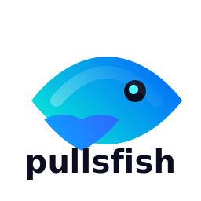

<div align="center">

  

  <h3>Pullfish</h3>

  A free and strong UCI chess engine maintained by Jorge Ruiz.
  <br>
  <strong>Collaborate with the community and help improve the engine.</strong>
  <br>
  <br>
  <a href="https://github.com/jorgeluisruiz/pullfish/issues/new">Report bug</a>
  ·
  <a href="https://github.com/jorgeluisruiz/pullfish/discussions/new">Open a discussion</a>
  ·
  <a href="https://discord.gg/GWDRS3kU6R">Discord</a>
  ·
  <a href="https://pullfish.org/blog">Blog</a>

</div>

> **Pullfish** es un motor UCI mantenido por **Jorge Ruiz**, con créditos
> especiales para **ChatGPT** y para los autores listados en [AUTHORS](AUTHORS).
> Este repositorio expone los fuentes del motor para facilitar la colaboración y
> el mantenimiento.

## Overview

Pullfish is a **free and strong UCI chess engine** that analyzes chess positions
and computes the optimal moves while preserving full compatibility with popular
front-ends.

Pullfish **does not include a graphical user interface** (GUI) and is normally
paired with third-party front-ends such as Fritz 20 or Cutechess. It implements
the Universal Chess Interface (UCI) protocol so those GUIs can discover it as
**Pullfish** in their engine lists.

## Files

This distribution of Pullfish consists of the following files:

  * [README.md](README.md), the file you are currently reading.

  * [Copying.txt](Copying.txt), a text file containing the GNU General Public
    License version 3.

  * [AUTHORS](AUTHORS), a text file with the list of authors for Pullfish.

  * [src](src), a subdirectory containing the full source code, including a
    Makefile that can be used to compile Pullfish on Unix-like systems.

  * a file with the .nnue extension, storing the neural network for the NNUE
    evaluation. Binary distributions will have this file embedded.

## Contributing

__See [Contributing Guide](CONTRIBUTING.md).__

### Donating hardware

Improving Pullfish requires a massive amount of testing. You can donate your
hardware resources by installing the Pullfish worker and joining the community
channels to coordinate testing campaigns.

### Improving the code

In the [chessprogramming wiki](https://www.chessprogramming.org/Main_Page), many
techniques used in Pullfish are explained with a lot of background information.
The [section on evaluation techniques](https://www.chessprogramming.org/Evaluation)
describes many features and techniques used by modern engines.

The engine testing is coordinated by the Pullfish maintainers. If you want to
help improve Pullfish, please read this
[guideline](https://github.com/jorgeluisruiz/pullfish/wiki/Getting-Started)
first, where the basics of development are explained.

Discussions about Pullfish take place mainly in the community
[Discord server](https://discord.gg/GWDRS3kU6R). This is the best place to ask
questions about the codebase and how to improve it.

## Compiling Pullfish

Pullfish has support for 32 or 64-bit CPUs, certain hardware instructions,
big-endian machines such as Power PC, and other platforms.

On Unix-like systems, it should be easy to compile Pullfish directly from the
source code with the included Makefile in the folder `src`. In general, it is
recommended to run `make help` to see a list of make targets with corresponding
descriptions. An example suitable for most Intel and AMD chips:

```
cd src
make -j profile-build
```

Detailed compilation instructions for all platforms can be found in the
[documentation](https://github.com/jorgeluisruiz/pullfish/wiki/Compilation). The
wiki also has information about the
[UCI commands](https://github.com/jorgeluisruiz/pullfish/wiki/UCI-Commands)
supported by Pullfish.

## Terms of use

Pullfish is free and distributed under the
[**GNU General Public License version 3**](Copying.txt) (GPL v3). Essentially,
this means you are free to do almost exactly what you want with the program,
including distributing it among your friends, making it available for download
from your website, selling it (either by itself or as part of some bigger
software package), or using it as the starting point for a software project of
your own.

The only real limitation is that whenever you distribute Pullfish in some way,
you MUST always include the license and the full source code (or a pointer to
where the source code can be found) to generate the exact binary you are
distributing. If you make any changes to the source code, these changes must
also be made available under GPL v3.

## Credits

Pullfish 17.1 is maintained by Jorge Ruiz with credits for ChatGPT and for the
contributors listed in [AUTHORS](AUTHORS). The project continues to benefit from
the innovations shared by the wider open-source chess community.

## Acknowledgements

Pullfish uses neural networks trained on
[data provided by the Leela Chess Zero project](https://training.lczero.org/),
which is made available under the
[Open Database License](https://opendatacommons.org/licenses/odbl/) (ODbL).

